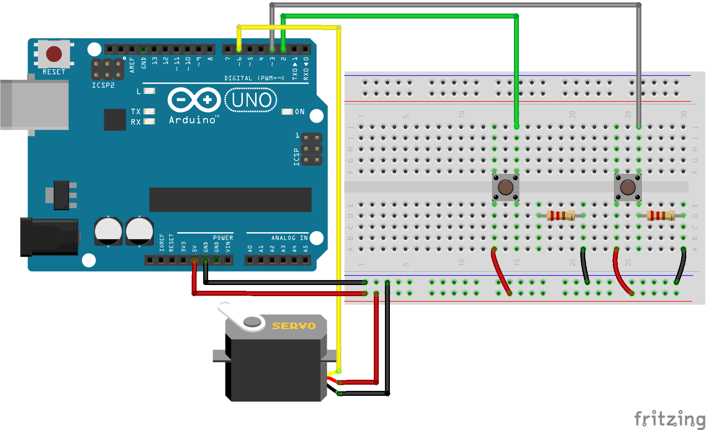

# Arduino-Servo-Testing

A lot of the smaller cheaper servos have inconsistent max and min pulses which means getting 0 and 180 degrees is often inaccurate, especially when using `servo.write` which requires an angle but that angle would not reflect mechanically on the servo hardware. This is to be used to roughly check the maximum and minimum pulses that correspond to 0 and 180 degrees to make the servo actuation more accurate. It uses simple components and simple and of course is by no means a very very accurate replacement for a signal generator.
 
 

